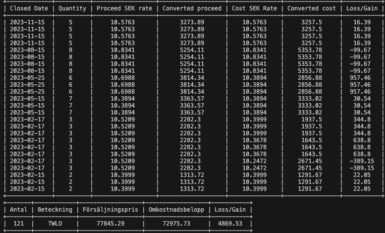

# TTAX
**NOT RESPONSIBLE FOR CAPITAL LOSS**

Small stock K4 calculator, for personal use.
Intended to be used for a certain company.
It uses loss/gain CSV together with USD/SEK exchange rate that is retrieved from <https://www.riksbank.se/sv/statistik/rantor-och-valutakurser/valutakurser-till-deklarationen> to calculate a summary for K4.

## Limitation
Currently only calculation of RSU stocks is possible and not ESPP.
Example if you are calculating for year 2023, it means you have sold shares in 2023 purchase date of those shares cannot be older than 2022. 
This is mainly for the limitation of number of SEK/USD conversion rate that I can get from ``www.riksbank.se``.

## Requirements
### Stock Loss/Gain list
1. Login in to charles Schwab
2. Select Individual account
3. Select History
4. Select ``Realized Gain / Loss``
5. Date range should be set to previous calendar year
6. Export (Top right)
7. Export Details Only

### Python requirements
* Python `3.9.16` 
* Run ``pip install -r requirements.txt``

## Usage

```python
python main.py loss_gain_file_location --from-year 2022 --to-year 2023
```

## Example
```python
python main.py stocks.csv --from-year 2022 --to-year 2024 
```
### Output



