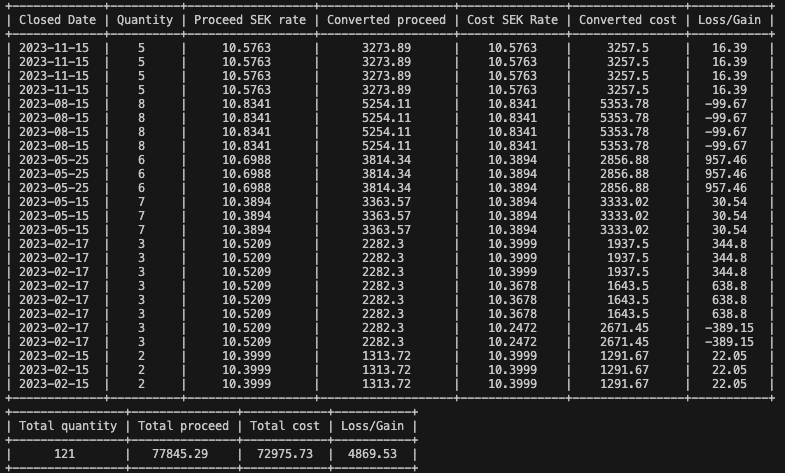

# TTAX
**NOT RESPONSIBLE FOR CAPITAL LOSS**

Small stock K4 calculator, for personal use.
Intended to be used for a certain company.
It uses loss/gain CSV together with USD/SEK exchange rate that is retrieved from ``www.riksbank.se``to calculate a summary for K4.

## Requirements
### Stock Loss/Gain list
1. Login in to charles Schwab
2. Select Individual account
3. Select ``Realized Gain / Loss``
4. Export
5. Export Details Only

### Python requirements
* Python `3.9.16` 
* Run ``pip install -r requirements.txt``

## Usage

```python
python main.py loss_gain_file_location taxyear
```

## Example
```python
python main.py stocks.csv 2023
```
### Output



